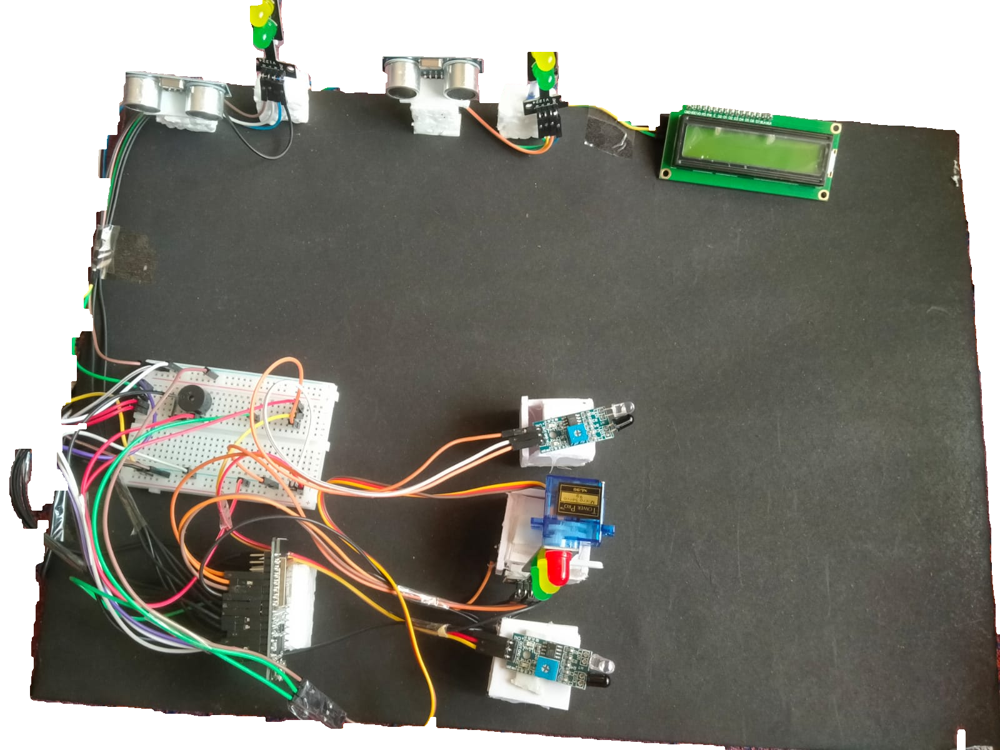

# 🚗 Smart Car Parking System
### ESP32 + IoT | WiFi Web Dashboard | Automated Slot Management

---

## 📸 Project Demo



> *Real working model with ESP32, HC-SR04 ultrasonic sensors, IR sensors, servo motor gate, traffic lights, LCD display, and buzzer — fully automated with WiFi web dashboard.*

---

## 🗂️ Block Diagram



---

## 📋 Project Overview

A **fully automated IoT-based Smart Car Parking System** using ESP32 microcontroller that:
- Monitors parking slot availability in **real time**
- Controls entry/exit gate **automatically** using IR sensors
- Allows users to **book slots remotely** via a WiFi web dashboard
- Detects **unauthorized parking** with buzzer alarm

**Subject:** 23ECR407 - Embedded Systems and IoT  
**College:** Karpagam College of Engineering, Coimbatore  
**Year:** 2026

---

## 🎯 Key Features

- ✅ Automated gate control using IR sensors + Servo motor (SG90)
- ✅ Real-time slot detection using HC-SR04 ultrasonic sensors
- ✅ WiFi-based web dashboard — no app installation needed
- ✅ Slot booking system with Name, Phone, Email validation
- ✅ Auto booking expiry after 10 minutes
- ✅ Unauthorized parking detection with buzzer alarm
- ✅ Check-in / Check-out time and duration tracking
- ✅ Traffic light indicators (RED / GREEN / YELLOW) per slot
- ✅ LCD 16×2 I2C display for local status
- ✅ Manual gate override from web dashboard

---

## 🔧 Hardware Components

| Component | Purpose |
|---|---|
| ESP32 | Main controller + WiFi web server |
| HC-SR04 × 2 | Detect car in Slot 1 and Slot 2 |
| IR Entry Sensor | Detect car arriving at gate → opens gate |
| IR Exit Sensor | Detect car passing through → closes gate |
| Servo Motor SG90 | Controls the physical gate barrier |
| Traffic Light × 3 | Visual slot and gate status indicators |
| Buzzer | Unauthorized parking alarm |
| LCD 16×2 I2C | Local real-time status display |

---

## ⚙️ How It Works

```
Car arrives at gate
      ↓
IR Entry Sensor detects → Gate OPENS automatically
      ↓
Car parks in slot
      ↓
HC-SR04 measures distance (< 10cm = OCCUPIED)
      ↓
Traffic light → RED (occupied) / GREEN (free) / YELLOW (booked)
      ↓
LCD shows slot status + available count
      ↓
Car leaves → IR Exit Sensor detects → Gate CLOSES
```

---

## 🌐 Web Dashboard Features

| Feature | Description |
|---|---|
| Live monitoring | Updates every 3 seconds automatically |
| Slot status | FREE / BOOKED / CONFIRMED / OCCUPIED / UNAUTHORIZED |
| Book slot | Enter Name, Phone (10 digits), Email with validation |
| Confirm arrival | Owner confirms before arriving |
| Auto expiry | Booking expires after 10 minutes |
| Check-in time | Recorded when car parks |
| Check-out time | Recorded when car leaves |
| Duration | Total parking time calculated automatically |
| Manual gate | Open and Close gate buttons on dashboard |

---

## 🚨 Unauthorized Parking Detection

If a slot is **booked** but the owner has **NOT confirmed arrival** and a stranger parks:
- 🔔 Buzzer sounds 3 long alarm beeps
- 📟 LCD shows **UNAUTHORIZED** warning for 5 seconds
- 🌐 Web dashboard shows flashing **UNAUTHORIZED** badge
- 📋 Original booking remains intact

---

## 🔌 Pin Configuration

```cpp
// ESP32 Pin Mapping
#define IR_ENTRY_PIN     GPIO_NUM_14
#define IR_EXIT_PIN      GPIO_NUM_27
#define SERVO_PIN        GPIO_NUM_26
#define TRIG1_PIN        GPIO_NUM_25   // Slot 1
#define ECHO1_PIN        GPIO_NUM_33
#define TRIG2_PIN        GPIO_NUM_32   // Slot 2
#define ECHO2_PIN        GPIO_NUM_35
#define BUZZER_PIN       GPIO_NUM_12
#define LCD_SDA          GPIO_NUM_21
#define LCD_SCL          GPIO_NUM_22
```

---

## 📡 Communication

- ESP32 connects to WiFi hotspot
- Hosts a web server at its local IP address
- Any device on the same WiFi opens the dashboard in a browser
- **No internet required** — works on local network

---

## 🛠️ Technologies Used

- **Platform:** ESP32 (Arduino IDE)
- **Language:** Embedded C++
- **Frontend:** HTML / CSS (Web Dashboard)
- **Protocol:** WiFi (HTTP Web Server)
- **Sensors:** HC-SR04, IR Sensor Module
- **Actuators:** Servo Motor SG90, Buzzer
- **Display:** LCD 16×2 with I2C module

---

## 📁 Repository Structure

```
Smart-Car-Parking-System/
│
├── smart_car_parking.ino               → Main ESP32 code
├── project_photo.png                   → Project hardware photo
├── smart_parking_block_diagram_clean.svg → System block diagram
└── README.md                           → Project documentation
```

---

## 🔮 Future Enhancements

- 📱 Mobile app for remote booking
- 💳 QR code based entry/exit system
- 📊 Parking analytics dashboard
- ☁️ Cloud-based data storage
- 🤖 AI-based license plate recognition

---

## 🏆 About This Project

> Built as part of **23ECR407 - Embedded Systems and IoT** coursework  
> Karpagam College of Engineering, Coimbatore — 2026

---

## 👨‍💻 Author

**ANU A**  
B.E. Electronics and Communication Engineering  
Karpagam College of Engineering, Coimbatore  
🔗 GitHub: github.com/Anuarumugam 
🔗 LinkedIn: linkedin.com/in/anu-a-86523a350
